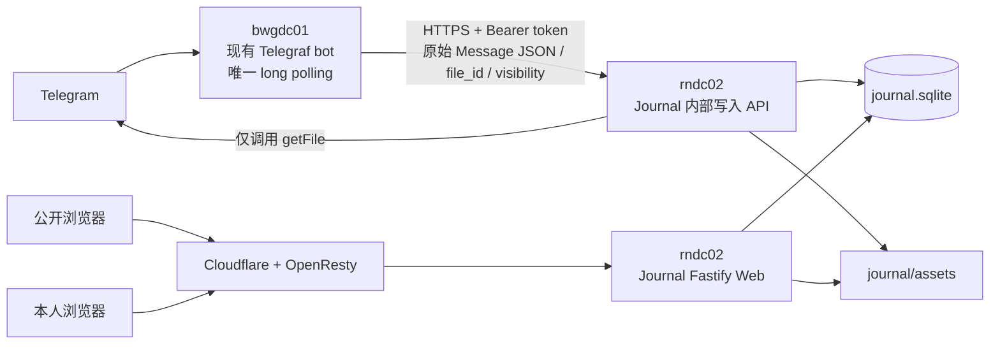

# Telegram 笔记 / 日记与个人信息流设计

状态：已确认，待实施  
日期：2026-07-19  
范围：初版产品与技术设计，不包含实现

与既有文档的关系：本方案吸收了 `note-personal-cloud-drive-requirements.md` 的 Telegram 全格式采集要求，以及 `snippet-inbox.md` 的标签、搜索和回顾思路。前者原本只保存到个人网盘，后者把 AI 处理放进主路径；本方案改为现有服务器自持有原始资产并直接提供公开/私有 Web 视图。方案确认后，应以本文作为 Journal 功能的实施依据，旧文档保留为需求演变记录。

## 1. 结论

建议在现有 NotiNewsForXiaoming 仓库内自行实现一个单用户 Journal 模块，而不是直接部署或二次开发一套通用博客、Memos 或联邦社交系统。

初版采用“现有 bot 保持不动、Journal 独立承载”的双节点形态：

```text
bwgdc01
└── 现有 NotiNews 常驻进程（唯一 Telegram long polling 消费者）
    ├── 现有提醒、订阅与定时任务
    └── Journal Telegram 采集入口
        └── HTTPS 内部写入 API

rndc02
└── 独立 Journal 容器（绝不启动 Telegram long polling）
    ├── Journal 内部写入 API
    ├── Telegram getFile 媒体下载
    ├── 公开信息流与私有资产页
    ├── journal.sqlite
    └── journal/assets/
```

这是职责拆分，不是两套 Journal 数据同步：`bwgdc01` 只负责接收 Telegram 消息和维护一次性等待状态，`rndc02` 是 Journal 记录与原始附件的唯一数据源。现有 bot 不迁移，Journal 发布失败也不会替换或停用它。

核心产品规则只有一条：**所有内容默认私有，只有用户明确执行“公开”动作后才会出现在公开网站。**

公开网站采用类似 X / 微博的单列时间线；登录后的私有页是同一份数据的完整资产视图，不建立“私有笔记库”和“公开博客”两份内容，也不做双向同步。

## 2. 现有项目事实与设计约束

以下结论来自当前仓库源码和已有文档，不是对未来实现的假设。

### 2.1 当前事实

- 主入口是 `src/resident.ts`，以单进程方式同时运行 Telegraf long polling、提醒恢复和固定任务。
- Telegram 交互只允许 `.env` 中 `TG_CHAT_ID` 对应的 chat，已经具备单用户鉴权边界。
- 普通非命令文本目前会进入自然语言提醒解析，因此 Journal 不能直接接管所有普通文本，否则会破坏提醒主路径。
- 项目共用 `data/notinews.sqlite`，由 `better-sqlite3` 管理，迁移版本记录在 SQLite `user_version`。
- 运行时数据都位于 `data/`，现有 Google Drive 每日备份已经整体包含该目录。
- 线上主形态是 systemd 常驻进程；当前没有 Web 服务、用户系统或对象存储。
- 当前 bot 继续位于 `bwgdc01`，它保持为唯一 Telegram long polling 实例；不迁移现有提醒、订阅、任务和 bot 数据。
- `rndc02` 只承载新增的 Journal API、SQLite、媒体文件和 Web，不运行 `bot.launch()`、`getUpdates` 或 webhook。
- Journal 命令通过 HTTPS 调用 `rndc02` 的内部写入 API；该调用失败时只让本次 `/note` 或 `/post` 失败，不改变现有 bot 的其他功能。
- `src/bot/interactive.ts` 已经较大，因此新功能只在其中增加一次注册调用，Journal 逻辑独立放入自己的功能目录。

### 2.2 对本设计的约束

- 继续按单用户个人工具设计。
- 不新增 PostgreSQL、Redis、消息队列、任务 Worker、搜索服务或独立媒体服务。
- 不改造现有提醒、订阅和定时任务的运行主路径，也不让 Journal 服务成为它们的启动依赖。
- `rndc02` 可使用同一 Telegram bot token 调用 `getFile` 下载媒体，但绝不消费 updates。
- 不增加多用户注册、关注关系、评论、点赞、联邦协议和审核系统。
- 不把 OCR、语音转写、AI 摘要或自动分类放入初版保存主路径。
- 媒体保存失败时直接返回失败，不只保存文字后假装整条内容成功。
- 公开与私有共用同一个数据源，通过字段和查询条件区分，不复制数据。

## 3. 同类项目调研

### 3.1 候选对比

| 项目 | 当前稳定状态 | 可借鉴点 | 不直接采用的原因 |
| --- | --- | --- | --- |
| [Memos](https://github.com/usememos/memos) | v0.27.1，2026-04-19；MIT | 时间线优先、附件、标签、REST API、SQLite，以及 `PRIVATE / PROTECTED / PUBLIC` 逐条可见性 | 产品最接近，但仍带有完整账号、通用知识库和实例管理能力；Telegram 全格式归档与定制信息流仍需另写适配，深度改样式最终会维护一份上游分叉 |
| [WriteFreely](https://writefreely.org/) | v0.16.0，2025-08-29；AGPL | 轻量、自托管、Markdown、单用户模式、公开博客和 ActivityPub | 核心是写作与长文发布；公开性主要按 blog 管理，媒体以嵌入为主，不适合作为 Telegram 原始媒体资产库 |
| [microfeed](https://github.com/microfeed/microfeed) | v0.1.5，2025-03-14；仍标记 open alpha；AGPL | 图片、音频、视频、文档统一进入 Web/RSS/JSON feed，前台样式可定制 | 绑定 Cloudflare Pages、D1、R2、Zero Trust，会把当前单服务器本地数据拆成另一套基础设施；重点是公开 CMS，不是私有日记资产 |
| 自行实现 | 与现有项目同仓维护 | 数据、交互、视觉和部署完全贴合个人使用 | 需要自行维护 Web 界面，但初版边界足够小，总代码与运维复杂度低于改造通用平台 |

### 3.2 采用的产品灵感

- 采用 Memos 的“时间线即首页”、逐条公开性和 `#标签` 组织方式。
- 采用 microfeed 的公开 RSS / JSON feed 思路，但不采用其 Cloudflare 架构。
- 采用 Day One 的“往年今日”。Day One 官方将它定位为重新阅读过往文字和照片的主要入口；该能力只需按月日查询，适合个人日记且开发量可控。参考：[Day One On This Day](https://dayoneapp.com/guides/tips-and-tutorials/on-this-day-view/)。
- 不采用社交产品的点赞、评论、转发、关注和推荐算法。

### 3.3 为什么不先部署 Memos 再同步

“bot 下载 Telegram 媒体 → 调 Memos API → Memos 再保存一份数据”会额外形成一套通用应用、数据库、鉴权和备份边界。Journal 的核心业务只有采集、可见性和展示，自建一个窄接口即可保留 Telegram 特有的语音、圆形视频、贴纸、联系人、位置、投票和相册语义。

本方案虽然有两个运行节点，但没有两份 Journal 数据：`bwgdc01` 只保存捕获会话，`rndc02` 单独持有 Journal 记录与附件。这是明确的数据所有权边界，不是数据库同步。因此，Memos 只作为交互参考，不作为运行依赖。

## 4. 产品定义

### 4.1 内容模型

统一称为“记录（Entry）”。日记、随手笔记和公开动态不是三种数据类型，而是同一种记录的不同使用方式。

每条记录包含：

- 正文或 caption；
- 一到多个原始附件；
- Telegram 能提供的结构化信息；
- 原消息时间和归档时间；
- `private` 或 `public` 可见性；
- `#标签`；
- 是否置顶；
- Telegram 原始消息 JSON，作为可迁移的原始证据。

### 4.2 可见性

初版只保留两级：

| 可见性 | 含义 | Web 行为 |
| --- | --- | --- |
| `private` | 个人资产，仅自己可见 | 只出现在登录后的 `/me` |
| `public` | 对外公开内容 | 出现在公开首页、公开详情、RSS 和 JSON feed |

不增加 `unlisted`、好友可见、密码分享或分组权限。Memos 的 `PROTECTED` 对单用户没有实际价值。

默认值永远是 `private`。公开必须来自 `/post`、Telegram 的“设为公开”按钮或私有网站中的明确操作。

### 4.3 初版用户路径

#### 私有文字

```text
/note 今天第一次完整跑完了 5 公里 #跑步
```

保存为私有记录。

#### 公开文字

```text
/post 今天的晚霞很好看。
```

保存为公开记录，并返回公开链接。

#### 保存已有消息

回复任意 Telegram 消息并发送 `/note` 或 `/post`，保存被回复的消息。适用于转发内容、已有照片、语音、视频和文件。

#### 发送下一条内容

单独发送 `/note` 或 `/post` 后，bot 进入一次性等待状态。用户随后发送的第一条内容被保存，保存完成后退出等待。`/cancel` 取消本次等待。

等待提示只发送一条 bot 消息；保存完成后直接编辑这条提示为结果卡片，避免新增确认消息污染消息流。

#### 媒体 caption

发送图片、视频或文件时，可以把 `/note` 或 `/post` 放在 caption 开头，命令后的文字作为记录正文。

#### 修改可见性

保存结果卡片提供：

```text
[🌐 设为公开 / 🔒 转为私有] [🌍 打开网站]
```

切换后编辑原结果卡片，不新增消息。转为私有后，原公开详情和媒体地址立即不可访问。

### 4.4 与现有提醒交互的关系

- 普通文本继续进入现有自然语言提醒主路径。
- 只有 `/note`、`/post`、回复命令、带命令的 caption，或处于一次性等待状态时，消息才进入 Journal。
- Journal handler 在现有通用 `message('text')` 提醒 handler 之前注册；成功匹配后不再把消息交给提醒解析。
- `/cancel` 只在 Journal 等待状态存在时取消 Journal；其他场景不改变现有行为。

## 5. Telegram 格式覆盖

### 5.1 可归档内容

初版覆盖 Telegram Bot API `Message` 能交给当前 bot 的用户内容：

| 类别 | 内容 | 保存与展示 |
| --- | --- | --- |
| 文字 | text、caption、entities | 保存原文和 entities；网页按纯文本安全渲染，保留换行、链接、`#标签` |
| 图片 | photo、live photo 可下载部分 | 下载可用的最高分辨率文件；相册显示为网格/轮播 |
| 视频 | video、video note、animation | 保存原文件；网页使用原生视频播放器，圆形视频保留圆形样式 |
| 音频 | voice、audio | 保存原文件及 duration、performer、title 等元数据；网页使用原生音频播放器 |
| 文件 | document | 保存原始文件名、MIME、大小和文件内容；网页提供下载 |
| 贴纸 | static / animated / video sticker | 保存原文件及 emoji、set name；支持浏览器的格式直接预览，其余提供原文件 |
| 位置 | location、venue | 保存经纬度和地点字段；显示静态信息与地图跳转链接，不接地图 SDK |
| 联系人 | contact | 保存 Telegram 提供的姓名、电话和 vCard 字段；私有页显示结构化卡片 |
| 投票与清单 | poll、checklist | 保存问题、选项、状态和原始 JSON；显示只读快照 |
| 其他结构化消息 | dice、game、story reference、paid media metadata 等 | 保存 Telegram 实际提供的元数据；只有 Bot API 提供可下载文件时才归档二进制 |

所有消息都保存 Telegram 原始 JSON。以后 Telegram 新增字段时，历史原始数据不会因当前表结构没有对应列而丢失；但新出现的二进制字段仍需增加明确的提取映射后才能下载文件。

服务消息、支付状态、群管理事件等不是生活记录输入，不纳入 Journal 捕获范围。

### 5.2 媒体组

Telegram 相册中的每个 `message_id` 独立保存，并通过同一个 `media_group_id` 关联。Web API 将同组记录聚合为一条信息流卡片；可见性切换、置顶和删除操作对整组生效。

这样不需要等待 Telegram 不会提供的“相册结束”事件，也不会为了拼相册引入持久化队列。相册中的单个文件失败时，bot 明确列出失败项，不把整组报告为完整成功。

### 5.3 官方文件大小边界

格式覆盖和文件大小是两个不同问题。

Telegram 官方云端 Bot API 的 `getFile` 当前只能下载最大 20 MB 的文件；官方 Local Bot API Server 可以无大小限制下载，并允许最高 2000 MB 上传。参考：[Telegram Bot API](https://core.telegram.org/bots/api#using-a-local-bot-api-server) 与 [Bots FAQ](https://core.telegram.org/bots/faq#how-do-i-download-files)。

初版继续使用当前云端 Bot API：

- 支持上述所有格式，但单个可下载文件受 20 MB 限制；
- 收到超限文件时直接返回明确错误，不创建“只有元数据但没有原文件”的成功记录；
- 保存 `file_id` 不能替代本地原始文件归档。

只有真实使用中经常出现超限文件时，再单独评估 Local Bot API Server。它会改变现有 Telegraf API endpoint 并增加一个常驻服务，不应为了理论上的大文件先加入初版。

## 6. Web 产品设计

### 6.1 公开信息流 `/`

公开首页是移动端优先的单列时间线：

- 顶部个人资料确定为：名称“小明同学”，简介“姚黄魏紫开次第，不觉成恨俱零凋”；
- 默认头像由项目本地提供：圆形柔和渐变背景，中间使用“明”字；同时保留 SVG 源文件和网页预览使用的 PNG，不引用随机网络头像或第三方头像服务；
- 记录按原消息时间倒序；
- 卡片直接展示文字、图片网格、视频、语音、音频或文件摘要；
- 点击时间进入永久详情 `/p/:publicId`；
- 点击标签进入公开标签筛选；
- 使用游标加载更早记录，不做页码；
- 无推荐算法、广告、互动数字和无限刷新提示；
- 提供公开 RSS `/rss.xml` 和 JSON Feed `/feed.json`。

公开页不加载任何私有记录数量、私有标签、私有媒体路径或私有时间分布。

### 6.2 私有资产页 `/me`

私有页登录后展示全部记录，主要能力为：

- `全部 / 私有 / 公开` 三个快速筛选；
- 正文关键词搜索；
- 按标签、内容格式、日期范围筛选；
- 编辑正文；
- 切换公开/私有；
- 置顶或取消置顶；
- 打开原始附件；
- “往年今日”：显示过去年份中同月同日的记录。

初版数据量按个人记录估算，正文搜索直接使用 SQLite `LIKE`，不建立 FTS、向量索引或外部搜索服务。只有实际数据量使查询变慢时才考虑 FTS5。

### 6.3 永久删除

删除属于首版必备能力。登录后的 `/me` 提供所有记录的二次确认删除；Telegram 新保存结果卡片提供原地删除与确认，便于立即纠错。普通记录删除自身，相册按 `media_group_id` 整组删除，正文、原始 Telegram JSON、数据库附件行和服务器附件文件同时移除。

首版不增加软删除、回收站、批量删除、自动重试或后台补偿任务，也不删除用户发送的 Telegram 原始消息。删除前已经生成的 rclone 历史备份继续遵循现有 30 天保留规则，不改写旧压缩包。具体接口、交互和一致性边界见 [`telegram-journal-entry-deletion.md`](./telegram-journal-entry-deletion.md)。

### 6.4 视觉方向

- 整体是个人主页而不是后台管理系统。
- 内容列宽约 680px，桌面端保留大面积留白，移动端贴近 Telegram/X 的阅读密度。
- 字体、颜色、圆角和间距集中为 CSS variables，方便个人持续改风格。
- 图片优先，语音/音频有明显波形感的进度条外观，但初版播放仍使用浏览器原生能力。
- 默认跟随系统深浅色，不增加主题商城或可视化搭建器。
- 私有内容使用稳定的锁形标记，公开内容使用地球标记，避免只靠颜色区分。
- 默认“明”字头像属于网站自身静态资产，后续替换正式头像时只替换资源文件，不调整数据模型或页面结构。

## 7. 技术设计

### 7.1 架构



`src/resident.ts` 仍只管理现有 bot 的生命周期，在其中注册 Journal Telegram handler，但不创建 Journal Web server。handler 匹配 `/note` 或 `/post` 后，把原始消息、目标可见性和确定性的请求标识发送给 `rndc02`。

`rndc02` 的 Journal 服务是独立入口，只提供内部写入 API、公开信息流和私有资产页。它使用 bot token 调用 Telegram `getFile` 获取附件，但代码中不注册 update handler，也不调用 `bot.launch()`、`getUpdates` 或 webhook。Web 端口只映射到宿主机回环地址，再由已有 1Panel OpenResty 提供域名和 HTTPS。

两个进程没有共同启动条件：Journal 服务不可用时，现有 bot 的提醒、订阅和定时任务继续运行；只有当次 Journal 命令明确失败。

一次性入口 `src/index.ts` 不启动 Journal Web。

### 7.2 技术栈

版本依据 2026-07-19 npm `latest` 稳定标签；实施时写入精确版本并由 lockfile 固定，不采用 alpha、beta、rc 或 edge 版本。

| 层 | 选型 | 当前 stable | 原因 |
| --- | --- | --- | --- |
| 运行时 | Node.js | 24.x | 项目现有硬约束，不更换运行时 |
| Telegram | Telegraf | 4.16.3 | `bwgdc01` 沿用现有 bot 接入；`rndc02` 只复用其 Telegram API 客户端能力调用 `getFile` |
| 数据库 | better-sqlite3 | 12.11.1 | 项目现有同步 SQLite 主路径 |
| Web 后端 | Fastify | 5.10.0 | 单进程 Node Web 服务，插件成熟，路由和流式文件响应直接 |
| 静态资源与 cookie | `@fastify/static` / `@fastify/cookie` | 10.1.0 / 11.1.2 | 使用 Fastify 官方插件，不手写静态文件和 cookie 协议 |
| Web 前端 | Vue | 3.5.40 | 体积可控、样式自由，适合单页信息流和少量管理交互 |
| 前端构建 | Vite / `@vitejs/plugin-vue` | 8.1.5 / 6.0.8 | Vite 8 已于 2026-03-12 发布 stable，并支持当前 Node 24 |
| 输入校验 | Zod | 4.4.3 | 项目现有依赖，用于配置和 Web 写接口输入 |
| 时间 | Day.js | 1.11.21 | 项目现有依赖，统一 `Asia/Shanghai` |

版本来源：各包的 [npm registry](https://registry.npmjs.org/) `latest` 元数据、[Vite 8 stable 公告](https://vite.dev/blog/announcing-vite8) 和 [Fastify v5 文档](https://fastify.dev/docs/v5.0.x/)。

前端使用 Vue 3 Composition API、`<script setup lang="ts">` 和单文件组件。初版不加入 Vue Router、Pinia、组件库或原子 CSS 框架：页面数量少，浏览器 History API 与功能级 composable 已足够。

### 7.3 代码边界

建议新增：

```text
src/
├── journal-bot/
│   ├── registerBotHandlers.ts   # /note、/post、等待状态和媒体消息入口
│   ├── client.ts                # 调用 rndc02 Journal 内部 API
│   ├── captureSessionRepository.ts
│   └── types.ts
├── journal-server/
│   ├── index.ts                 # 独立 Journal 服务入口，不启动 bot polling
│   ├── server.ts                # Fastify 创建与生命周期
│   ├── ingest.ts                # 内部写入 API 与消息归档事务
│   ├── telegramContent.ts       # 当前 Bot API 内容映射
│   ├── telegramFiles.ts         # 仅调用 getFile 下载媒体
│   ├── repository.ts            # Journal SQLite 查询与写入
│   ├── migrations.ts            # Journal 独立数据库迁移
│   ├── storage.ts               # 原始附件落盘
│   ├── auth.ts                  # 内部 token、单密码登录与私有路由鉴权
│   └── routes/
│       ├── publicFeed.ts
│       ├── privateEntries.ts
│       └── media.ts
├── shared/
│   └── journalProtocol.ts       # 两端共用的请求/响应 schema
└── resident.ts                  # 只增加 Journal Telegram handler 注册

web/
├── index.html
└── src/
    ├── App.vue
    ├── api.ts
    ├── assets/main.css
    ├── composables/useFeed.ts
    └── components/journal/
        ├── FeedView.vue
        ├── EntryCard.vue
        ├── MediaGallery.vue
        ├── EntryFilters.vue
        └── OnThisDay.vue
```

组件职责保持单一：`FeedView` 负责列表编排，`EntryCard` 负责一条记录，`MediaGallery` 负责媒体格式分派，筛选与加载状态放入 composable。记录正文使用 Vue 文本插值，不把 Telegram 内容直接交给 `v-html`。

现有 `interactive.ts` 只增加 `registerJournalBotHandlers(bot)` 调用，不把 Journal 的命令实现继续堆入该文件。`journal-bot` 不引用 Journal 数据库和附件存储；`journal-server` 不引用 bot 的提醒、订阅和 update handler。

## 8. 数据设计

### 8.1 `journal_entries`

```sql
CREATE TABLE journal_entries (
  id INTEGER PRIMARY KEY AUTOINCREMENT,
  public_id TEXT NOT NULL UNIQUE,
  chat_id TEXT NOT NULL,
  source_message_id INTEGER NOT NULL,
  media_group_id TEXT,
  content_type TEXT NOT NULL,
  content_text TEXT NOT NULL DEFAULT '',
  visibility TEXT NOT NULL CHECK (visibility IN ('private', 'public')),
  tags_json TEXT NOT NULL DEFAULT '[]',
  telegram_message_json TEXT NOT NULL,
  pinned INTEGER NOT NULL DEFAULT 0 CHECK (pinned IN (0, 1)),
  source_created_at TEXT NOT NULL,
  captured_at TEXT NOT NULL,
  updated_at TEXT NOT NULL,
  UNIQUE(chat_id, source_message_id)
);
```

说明：

- `public_id` 使用 `crypto.randomUUID()`，公开地址不暴露自增序号。
- `source_created_at` 使用 Telegram 消息时间，时间线和“往年今日”以它为准。
- `captured_at` 记录实际归档时间。
- `telegram_message_json` 保存 bot 实际收到的原始消息，不保存 bot token。
- 同一原消息重复执行保存时不创建重复资产；如果本次命令指定了不同可见性，则更新现有记录（相册则更新整组）并返回现有记录。
- 同一 `media_group_id` 的查询结果在 API 层聚合；可见性和置顶更新按整组执行。

### 8.2 `journal_assets`

```sql
CREATE TABLE journal_assets (
  id INTEGER PRIMARY KEY AUTOINCREMENT,
  entry_id INTEGER NOT NULL,
  kind TEXT NOT NULL,
  telegram_file_id TEXT NOT NULL,
  telegram_file_unique_id TEXT NOT NULL,
  original_name TEXT,
  mime_type TEXT,
  byte_size INTEGER,
  relative_path TEXT NOT NULL UNIQUE,
  width INTEGER,
  height INTEGER,
  duration INTEGER,
  sort_order INTEGER NOT NULL DEFAULT 0,
  FOREIGN KEY(entry_id) REFERENCES journal_entries(id)
);
```

该表与 `journal_entries` 仅存在于 `rndc02` 的 `/opt/journal/data/journal.sqlite`。磁盘使用不可猜测且不含用户输入的文件名：

```text
/opt/journal/data/assets/YYYY/MM/<public_id>/<asset_uuid>
```

原始文件名只作为数据库元数据和下载响应名，不直接拼入服务器路径。文件内容不写入 SQLite，避免数据库因视频、音频快速膨胀。

### 8.3 `journal_capture_sessions`

```sql
CREATE TABLE journal_capture_sessions (
  chat_id TEXT PRIMARY KEY,
  visibility TEXT NOT NULL CHECK (visibility IN ('private', 'public')),
  prompt_message_id INTEGER NOT NULL,
  created_at TEXT NOT NULL
);
```

该表只支持 `/note` 或 `/post` 后等待下一条消息。保存成功或 `/cancel` 后删除记录，不增加自动过期、恢复分支或复杂状态机。

该表属于 `bwgdc01` 现有 `data/notinews.sqlite`，因为等待状态服务于 Telegram 消息接收。它不保存 Journal 正文、原始 JSON 或媒体，也不与 `rndc02` 同步。

### 8.4 索引

只增加实际查询需要的索引：

- `(visibility, pinned, source_created_at)`：公开/私有时间线；
- `(media_group_id)`：相册聚合和整组更新；
- `(source_created_at)`：日期筛选和往年今日。

`journal_capture_sessions` 继续由 `bwgdc01` 现有 `src/reminders/migrations.ts` 的下一个版本创建；`journal_entries`、`journal_assets` 和上述 Journal 索引由 `rndc02` 的 `src/journal-server/migrations.ts` 管理。两者对应两个物理数据库，不共享 `user_version`，也不引入第三方迁移框架。

## 9. 保存主路径与一致性

单条消息的保存流程：

1. `bwgdc01` 鉴权并确认捕获来源与目标可见性，生成确定性的请求标识 `chat_id:source_message_id`。
2. bot 通过 HTTPS 向 `POST /api/internal/telegram-entries` 发送原始 Telegram Message JSON、目标可见性和请求标识；不在请求中发送 bot token 或媒体文件。
3. `rndc02` 校验 Bearer token、`TG_CHAT_ID` 和 Zod schema，解析正文、entities、内容类型、结构化字段与全部 `file_id`。
4. Journal 服务使用环境变量中的同一 bot token 仅调用 Telegram `getFile`，把全部附件写入本次记录的临时目录。
5. 所有附件完成后，把临时目录原子改名为最终目录，并在一个 SQLite transaction 中写入 `journal_entries` 和 `journal_assets`。
6. API 返回记录与公开链接；bot 编辑原等待提示或保存结果卡片。一次性等待状态只在 API 确认保存成功后删除。

失败规则：

- 任一必需附件失败，本条记录不写入数据库；
- 已创建的本次临时文件被清理后，原错误继续抛出；
- API 或网络失败只让本次 Journal 操作失败，并向用户暴露具体阶段；现有提醒、订阅、定时任务和其他 bot 命令不依赖 Journal 服务；
- 不重试、不在 `bwgdc01` 暂存媒体、不改存 Telegram `file_id`、不改走其他网盘、不返回默认成功；
- 一次性等待的 API 调用失败时保留等待状态，用户可 `/cancel` 或重新发送；
- `(chat_id, source_message_id)` 是服务端幂等边界。若服务端已提交但响应在网络中丢失，用户重新提交同一消息时返回既有记录，不创建重复资产；
- SQLite 成功后若 Telegram 结果回复失败，记录仍然已经真实保存，错误直接暴露，不回滚已完成的资产保存。

最后一条是明确的事务边界：Telegram 确认消息不是资产本身，不能因为回复发送失败而删除已经保存成功的个人数据。

## 10. Web API 与媒体访问

### 10.1 内部写入接口

- `POST /api/internal/telegram-entries`
- `PATCH /api/internal/telegram-entries/:publicId/visibility`

接口只供 `bwgdc01` 的现有 bot 使用，以独立的 `JOURNAL_INGEST_TOKEN` 进行 Bearer 鉴权，并固定校验允许的 `TG_CHAT_ID`。写入请求包含原始 Message JSON、`file_id` 和可见性，不包含 Telegram bot token；接口日志也不记录 token、完整 Authorization header 或原始私密正文。

内部接口与公开网站共用 `feeds.xmcloud.buzz` 的 HTTPS 入口，但不依赖浏览器 cookie。`rndc02` 不提供接收 Telegram updates 的接口。

### 10.2 公开只读接口

- `GET /api/feed?cursor=...&tag=...`
- `GET /api/entries/:publicId`
- `GET /media/:assetId`
- `GET /rss.xml`
- `GET /feed.json`

所有公开查询在 repository 层固定包含 `visibility = 'public'`，而不是先查全部再在前端过滤。

### 10.3 私有接口

- `POST /api/auth/login`
- `POST /api/auth/logout`
- `GET /api/me/entries`
- `GET /api/me/on-this-day`
- `PATCH /api/me/entries/:id/content`
- `PATCH /api/me/entries/:id/visibility`
- `PATCH /api/me/entries/:id/pinned`

所有写接口通过 Zod 约束输入，只接受当前业务需要的字段。

### 10.4 媒体访问

- `journal/assets` 不作为公开静态目录挂载。
- 每次媒体请求先按 `assetId` 联表读取所属 Entry。
- public Entry 的附件允许匿名读取；private Entry 必须具备本人会话。
- Fastify 负责文件流和 Range 请求，使视频和音频可以拖动播放。
- 响应的 `Content-Type` 来自保存时的 Telegram MIME 元数据；下载文件名使用原始文件名。
- 私有媒体响应禁止公共缓存；公开媒体可由反向代理缓存。

## 11. 单用户登录

初版不建立 users 表。配置按节点明确分开：

- `bwgdc01` 保留现有 `TG_TOKEN` 与 `TG_CHAT_ID`，只新增 `JOURNAL_API_BASE_URL` 和 `JOURNAL_INGEST_TOKEN`。
- `rndc02` 的 Journal `.env` 包含用于 `getFile` 的 `TG_TOKEN`、允许来源的 `TG_CHAT_ID`、`JOURNAL_INGEST_TOKEN`、`JOURNAL_ADMIN_PASSWORD`、`JOURNAL_COOKIE_SECRET`、`JOURNAL_PUBLIC_BASE_URL` 和 `JOURNAL_WEB_PORT`。
- 两端使用同一个高强度 `JOURNAL_INGEST_TOKEN`。Telegram token 会存在于两台机器的环境变量中，这是不迁移现有 bot、又由 `rndc02` 直接下载媒体的明确代价；不得写入请求体、数据库、镜像或日志。
- 登录成功后由 `@fastify/cookie` 写入签名、`HttpOnly`、`Secure`、`SameSite=Strict` cookie。
- cookie 只表达“当前是唯一管理员”，不承载个人内容。
- `/me`、`/api/me/*` 和私有媒体统一检查该 cookie。
- 不提供注册、找回密码、第三方 OAuth、角色或设备管理。
- Web 只绑定本机地址，公网入口必须经 HTTPS 反向代理。

公开页面和私有页面共享前端组件，但数据请求和媒体 URL 由后端权限边界决定，不能依赖“前端不显示”保护私有内容。

## 12. 部署与备份影响

### 12.1 目标服务器审计结论

2026-07-19 已通过只读方式审计 `ssh rndc02`，没有修改服务器、Cloudflare 或现有服务。审计时观察到：

- Debian 10、x86_64、3 核 CPU、约 2.9 GiB 内存和 3 GiB Swap；
- 可用内存约 1.6 GiB，根分区可用约 29 GiB，当前负载很低；
- 已安装 Docker 26.1.4、Docker Compose 2.27.1 和 1Panel v1.10.20-lts；
- 1Panel OpenResty 已容器化运行，并使用 host 网络；
- 宿主机没有 Node.js、pnpm、`rclone`、`restic` 或 `borg`；
- 已有 xboard、MySQL、Redis、phpMyAdmin、OpenResty 等容器；
- `feeds.xmcloud.buzz` 在 Cloudflare 没有现存 DNS 记录，OpenResty 也没有同名站点；
- `127.0.0.1:3100` 当前未被占用，可以作为 Journal 的宿主机内部端口。

资源上可以承载新增的 Journal 服务。现有 NotiNews bot 不迁入 `rndc02`；Journal 部署必须独立于已有容器、数据库、Redis、网络和站点，不修改或复用它们的业务数据。

### 12.2 Docker 部署形态

宿主机不安装 Node.js、pnpm、PM2 或另一套 Web 服务。复用现有 Docker 与 Docker Compose，只部署一个独立的 Journal 容器；该容器包含 Journal API、Web 和媒体下载能力，但不包含 Telegram long polling。

目标结构：

```text
/opt/journal/
├── compose.yaml
├── .env
├── .deploy-commit
└── data/
    ├── journal.sqlite
    └── assets/
```

部署要求：

- 使用独立的 Compose project、容器名和 Docker network；
- Journal SQLite、媒体、`.env` 和部署版本标识全部位于容器外；
- Web 端口只映射到宿主机 `127.0.0.1:3100`，不使用 `0.0.0.0`；
- 容器时区固定为 `Asia/Shanghai`，不继承宿主机的 `America/New_York`；
- 容器初始资源边界为 1 CPU、512 MiB 内存，防止异常占用影响现有服务；
- 使用明确的容器状态和不可变发布版本；
- Web 前端产物包含在同一个应用镜像中，由 Fastify 提供；
- 应用镜像在服务器外生成，`rndc02` 只拉取并切换已生成的版本，避免构建过程抢占现有业务资源；
- 不连接现有 MySQL、Redis、xboard network 或 `1panel-network`，也不挂载 `bwgdc01` 的 `notinews.sqlite`；
- 不修改已有容器的端口、重启策略、资源配置或挂载目录。
- Journal 容器中的 Telegram 客户端只允许执行 `getFile` 相关请求，应用入口不启动 polling、webhook 或现有 bot 任务。

### 12.3 1Panel OpenResty 与 Cloudflare

公开访问域名确定为 `feeds.xmcloud.buzz`，请求路径为：

```text
访客
→ Cloudflare
→ feeds.xmcloud.buzz
→ rndc02 的 1Panel OpenResty
→ 127.0.0.1:3100
→ Journal 容器
```

- 复用 `rndc02` 已有 1Panel OpenResty，不安装 Nginx、Caddy 或第二个 OpenResty。
- 为 `feeds.xmcloud.buzz` 增加独立站点配置，不修改 `pro.xmcloud.buzz`、`yoyo.xmcloud.buzz`、`yoyoscore.cc` 等已有站点。
- OpenResty 站点配置位于现有挂载目录 `/opt/1panel/apps/openresty/openresty/conf/conf.d`。
- 反向代理目标固定为 `http://127.0.0.1:3100`。
- Cloudflare 新建指向 `rndc02` 当前公网地址的代理 DNS 记录；部署时重新查询实际地址，不在代码中硬编码。
- 为 `feeds.xmcloud.buzz` 单独签发 Cloudflare Origin CA 证书，不复用其他站点证书。
- Cloudflare 到源站使用 `Full (strict)`，不使用 `Flexible`。
- 公开媒体使用正常公共缓存策略；`/me`、`/api/me/*` 和私有媒体明确返回 `Cache-Control: private, no-store`。
- 初版不使用 Cloudflare Pages、Workers、D1、R2、Images、Stream 或 Tunnel。

### 12.4 GitHub Actions 自动发布

当前仓库已经存在 `.github/workflows/deploy.yml`，其实际行为是：

- 向 `main` 推送非 `doc/**`、非 Markdown 变更时自动触发，也支持手动触发；
- 目标主机、端口、用户和目录由 `SERVER_*` Secrets 决定，workflow 文件本身不暴露目标值；
- 通过 SSH 保留服务器上的 `.env`、`.npmrc` 和 `data/`，同步当前 commit 的其余跟踪文件；
- 在目标服务器安装依赖，更新 `notinews-bot.service` 并重启现有 bot；
- 完成后向 Telegram 发送 commit 与服务状态通知。

用户已确认该 workflow 是当前 `bwgdc01` bot 的正式发布链路。`.github/workflows/daily-push.yml` 只是手动运行一次性推送任务，不属于常驻 bot 或 Journal 部署。

现有 `deploy.yml` 的宽泛触发范围必须在 Journal 实现进入 `main` 前调整。否则只修改 `src/journal-server/**` 或 `web/**` 也会同步到 `bwgdc01` 并重启成熟 bot。初版不拆仓库，采用一个按路径判断、按依赖顺序执行的生产发布编排：

```text
push main / workflow_dispatch
└── 判断本次变更范围
    ├── 仅 Journal：只发布 rndc02 Journal
    ├── 仅 bot：只发布 bwgdc01 bot
    └── 两端或共享契约：先发布 rndc02 Journal，成功后再发布 bwgdc01 bot
```

路径边界：

- Journal：`src/journal-server/**`、`web/**`、`deploy/journal/**`、`scripts/journal-backup`；
- bot：现有 `src/**` 中除 `src/journal-server/**` 外的代码、`src/journal-bot/**` 和现有 bot 部署文件；
- 两端共享：`src/shared/journalProtocol.ts`、`package.json`、`pnpm-lock.yaml`、`tsconfig.json` 和生产 workflow 本身；
- `doc/**` 与 Markdown 变更继续不触发生产部署。

共享路径发生变化时两端都发布，并由同一 workflow 的 job 依赖保证 Journal 先于 bot。不能用两个互不关联、同时响应 `push` 的 workflow，因为它们无法保证跨服务器发布顺序。

Journal 自动发布要求：

- GitHub Actions runner 生成按 commit SHA 标识的不可变 Journal 镜像，不在 `rndc02` 构建；
- 使用 Journal 专用非 root 部署用户、独立 Ed25519 key 和仅覆盖 `/opt/journal` 与 Journal 容器所需范围的权限；
- Journal 使用独立 Secrets，包括目标主机、部署用户、SSH key 和预先可信保存的 known_hosts，不复用 `bwgdc01` 的 `SERVER_*` 凭据；
- workflow 不在每次发布时动态信任 SSH host key，也不输出 key、token 或环境变量值；
- 自动发布只加载新镜像、更新 Journal 自身版本标识并切换 Journal 容器，不修改 OpenResty、DNS、rclone 配置、Docker daemon 或其他容器；
- `/opt/journal/.env` 与 `/opt/journal/data/` 始终保留在服务器，不进入仓库、镜像或 Actions artifact；
- 同一时间只允许一个生产发布编排执行，正在执行的发布不被后续 push 从中间取消。

OpenResty 站点、Cloudflare DNS、Origin CA、`/opt/journal` 权限、专用部署用户和 rclone 属于首次部署准备，由主 agent 串行建立；后续代码 push 才走 GitHub Actions 自动发布。

### 12.5 安全部署顺序与故障隔离

- 第一步只在 `rndc02` 准备专用部署用户、`/opt/journal`、Journal 容器运行边界、回环端口、独立 OpenResty 站点和 HTTPS；此时不修改 `bwgdc01` 的现有 bot。
- Journal 域名只在 `rndc02` 本机服务和源站 HTTPS 就绪后接入 Cloudflare 流量。
- Journal 首次发布通过 GitHub Actions 完成，内部 API、数据库和媒体存储就绪后，才允许同一发布编排继续把 `/note`、`/post` handler 与 HTTPS client 发布到 `bwgdc01`。
- 全程不存在“先停止旧 bot、再切到新 bot”的迁移步骤；`bwgdc01` 始终是唯一 Telegram long polling 消费者，`rndc02` 永远不参与 updates 消费。
- `rndc02` 未部署完成或 Journal 服务故障时，原 bot 及其提醒、订阅和任务仍按原路径运行；只有 `/note`、`/post` 和 Journal 可见性操作返回明确失败。
- 部署只操作 Journal 自身和 `bwgdc01` 中直接相关的 handler，不重启 Docker daemon，不重启或重建 `rndc02` 的任何已有容器。

### 12.6 rclone 与异地备份

用户已明确允许在 `rndc02` 安装 `rclone`。这是本功能唯一新增的宿主机工具，用于延续现有 Google Drive 单一异地备份主路径；不再安装 `restic`、`borg` 或第二套备份工具。

- 沿用 Google Drive remote `notinews-drive`，Journal 使用独立远端子目录 `NotiNewsBackups-LongTerm/rndc02-journal`，避免与 `bwgdc01` 的既有备份混淆；
- 每日备份包含 `/opt/journal/.env`、`.deploy-commit`、完整 `data/`、Compose 配置和 Journal 的 OpenResty 站点配置；
- 备份前只停止 Journal 容器，不停止 `bwgdc01` 的 bot、Docker daemon、OpenResty 或其他容器；
- 完成归档与上传后再恢复 Journal 容器；
- 保留时间继续为 30 天；
- 任一步骤失败时任务直接失败并保留明确日志，不重试、不改传其他网盘；
- 1Panel 现有 MySQL 本地备份保持原样，不将其视为 Journal 的异地备份，也不修改其计划；
- 媒体会增加每日备份包体积和 Google Drive 占用，初版不压缩媒体、不转码、不清理旧媒体；
- 恢复时 `journal.sqlite` 与 `data/assets` 必须来自同一份恢复包。
- `bwgdc01` 现有 bot 数据及其备份流程保持原样，不并入或替换为 `rndc02` 的 Journal 备份。

### 12.7 已有服务保护边界

- 不使用当前对外监听的 MySQL `3306`、Redis `6379` 或 1Panel 管理端口；
- 不修改已有防火墙、数据库、Redis、PHP、xboard、phpMyAdmin 或站点配置；
- 不占用已有的 `80`、`443`、`7001`、`7010`、`8089` 等端口；
- 只新增 `/opt/journal`、Journal 容器、回环端口、OpenResty 独立站点、Cloudflare 独立 DNS 记录和已获允许的 `rclone`；
- 后续每次部署前重新核对容器名、端口、OpenResty 容器和目标 DNS，不能把本次审计结果当作永久事实。

### 12.8 跨节点安全边界

- `bwgdc01 → rndc02` 只通过 `feeds.xmcloud.buzz` 的 HTTPS 内部接口传输，使用独立 Bearer token；不开放数据库端口、共享目录或 SSH 写入通道作为运行时协议。
- Journal 数据库与媒体仅落在 `rndc02`，`bwgdc01` 不建立待同步的 Journal 副本。
- `rndc02` 持有 Telegram bot token 的目的仅是下载消息中已经提供 `file_id` 的媒体；它没有消费 updates 的代码路径。
- 内部 API 使用 `(chat_id, source_message_id)` 防止响应丢失后的人工重提产生重复记录，但不引入自动重试、消息队列或失败暂存。
- 现有 bot 与 Journal 的启动、停止和数据目录互不绑定；任何 Journal 操作不得修改 `rndc02` 已有服务或 `bwgdc01` 的非 Journal 业务。

### 12.9 已接受的方案代价

- Journal 采集依赖两台机器之间的网络与 `rndc02` 服务状态，因此网络中断时 `/note`、`/post` 会直接失败；代价换来的是现有 bot 主功能不随 Journal 一起迁移或停机。
- 同一 Telegram bot token 需要安全保存在两台机器的环境变量中，凭据暴露面比单机方案多一处。Journal 应用代码只调用 `getFile`，但 Telegram token 本身不能被裁剪成只读权限；若 `rndc02` 上的 token 泄露，仍等同于完整 bot token 泄露。
- 发布时需要在同一个 GitHub Actions 编排中维护 `bwgdc01` bot 与 `rndc02` Journal 两个部署 job，比单机多一个部署目标和一组 Secrets，但不增加数据库同步、消息队列或服务发现。
- 私有记录的原始消息会通过 Cloudflare 代理的 HTTPS 写入接口到达 `rndc02`；初版接受该链路，不额外部署 VPN、Tunnel 或专线组件。
- Journal 的唯一数据副本位于 `rndc02`，该机故障时网站和新增采集同时不可用；恢复依赖独立 rclone 备份，但现有 bot 的其他能力仍可继续使用。

## 13. 初版功能清单

### 13.1 包含

- `/note` 私有保存与 `/post` 公开保存；
- 命令正文、回复消息、一次性等待、媒体 caption；
- Telegram 当前可获得的文字、媒体和结构化内容；
- 原始文件与原始消息 JSON；
- 相册聚合展示；
- Telegram 结果卡片与公开/私有切换；
- 公开信息流、公开详情、标签筛选；
- 私有资产页、搜索、格式/日期/标签筛选；
- 正文编辑、置顶、可见性切换和二次确认永久删除；
- 往年今日；
- 公开 RSS 与 JSON Feed；
- 单密码本人登录；
- `bwgdc01` 保持唯一 Telegram long polling，现有 bot 仅增加 Journal handler 和内部 API client；
- `rndc02` 独立 Journal SQLite、媒体目录、容器与 rclone 备份边界；
- HTTPS 内部写入接口、Bearer 鉴权与按 Telegram 原消息幂等写入。

### 13.2 不包含

- 多用户、关注、评论、点赞、转发、私信；
- ActivityPub、Mastodon 或其他联邦协议；
- AI 摘要、自动标签、OCR、语音转文字；
- 图片压缩、缩略图生成、视频转码和波形预计算；
- S3、R2、CDN 或网盘作为主存储；
- 重试队列、失败暂存、备用上传通道；
- 全文搜索引擎、向量数据库或推荐算法；
- 公开内容审核、访客账号和访问统计；
- 回收站、软删除和批量删除；
- Local Bot API Server。

## 14. 实施顺序

### 阶段一：`rndc02` Journal 独立服务

先建立 Journal 独立 SQLite、附件存储、迁移、Telegram `getFile` 下载、HTTPS 内部写入 API、Bearer 鉴权和按原消息幂等写入。完成 Journal 容器、OpenResty、Cloudflare 域名、rclone 独立备份边界和 GitHub Actions Journal 发布 job；该阶段不修改、不停止 `bwgdc01` 的现有 bot，也不启动第二个 Telegram polling。

### 阶段二：Telegram 采集闭环

在 `bwgdc01` 现有 bot 中增加 `/note`、`/post`、回复保存、一次性等待、保存结果卡片、全部格式映射和内部 API client。调整现有 GitHub Actions 的路径范围与 job 依赖，使两端共同变化时先发布 Journal 再重启 bot。任何失败只在 Journal handler 中直接返回，不改变提醒、订阅和任务主路径。

### 阶段三：公开信息流与个人回看

在 `rndc02` 增加公开 API、受控媒体路由、Vue 单列信息流、`/me` 登录、搜索筛选、正文编辑、置顶、永久删除、往年今日、RSS 和 JSON Feed。

三个阶段使用 `rndc02` 上同一份 Journal 数据，不需要阶段间数据搬迁；`bwgdc01` 只保存一次性捕获会话。

## 15. 完成判定

- `/note` 的文字、图片、语音、视频和文件不会进入提醒解析，并以私有记录出现于 `/me`。
- 回复消息和一次性等待两条路径都能保存目标消息，而不是保存命令本身。
- 公开记录出现在匿名时间线，私有记录不会出现在公开 API、详情、媒体、RSS 或 JSON Feed。
- 一条记录在 Telegram 或 `/me` 转为私有后，其公开详情和附件立即不再可访问。
- 相册在网页中作为一条信息流内容展示，并能整体切换可见性。
- 结构化消息保留 Telegram 原始 JSON，位置、联系人和投票能以只读卡片查看。
- 附件失败不会产生声称完整成功的记录。
- 普通自然语言提醒、现有命令、调度和一次性入口的职责保持不变。
- `bwgdc01` 始终是唯一 Telegram long polling 消费者，`rndc02` 只调用 `getFile`，不接收 updates。
- Journal 服务中断时，现有 bot 的提醒、订阅、定时任务和非 Journal 命令不受影响。
- 同一 Telegram 原消息在请求结果不确定后被人工重提，不产生重复记录或重复附件。
- Journal 记录与附件全部位于 `rndc02` 的 `/opt/journal/data/`，并使用独立 rclone 备份；现有 bot 数据仍保留在 `bwgdc01` 原位置与原备份边界。
- 推送 Journal-only 代码不会重启 `bwgdc01` bot，推送 bot-only 代码不会操作 `rndc02` Journal；共享变更会按 Journal 在前、bot 在后的顺序自动发布。

## 16. 已确认的实施决策

### 16.1 域名与承载

- 公开域名：`feeds.xmcloud.buzz`。
- 域名继续作为个人品牌入口，Cloudflare 与个人域名不是二选一。
- 使用 Cloudflare 免费服务提供 DNS、代理和 Universal SSL。
- Journal Node.js 进程、SQLite 和原始媒体位于 `rndc02`；现有 bot 位于 `bwgdc01`。
- 不把应用迁到 Cloudflare Pages / Workers，也不把数据拆到 D1 / R2。
- 初版不增加 Cloudflare Tunnel 常驻组件。

请求路径为：

```text
访客
→ Cloudflare
→ feeds.xmcloud.buzz
→ VPS 反向代理
→ Journal Fastify 服务
```

Telegram 采集路径为：

```text
Telegram
→ bwgdc01 现有 bot（唯一 long polling）
→ HTTPS Journal 内部写入 API
→ rndc02 Journal 服务
```

### 16.2 公开主页资料

- 名称：小明同学
- 简介：姚黄魏紫开次第，不觉成恨俱零凋
- 头像：项目内置“明”字默认头像，使用本地 SVG 与 PNG 资产，不依赖网络随机头像或第三方头像服务。

### 16.3 Telegram 文件限制

- 接受初版单文件 20 MB 的 Telegram 云端 Bot API 下载限制。
- 继续使用现有 Telegram 云端 Bot API 和 Telegraf 接入方式。
- 下载前读取 Telegram 提供的 `file_size`；超限时直接报告具体文件和限制，不创建缺少原文件的成功记录。
- 不部署 Local Bot API Server，不增加压缩、转码、备用存储或重试路径。
- 如果后续真实记录中频繁出现超限文件，再把 Local Bot API Server 作为独立方案重新评估。

### 16.4 目标服务器与系统风险

- 新增的 Journal API、Web、SQLite 和媒体存储确定部署到 `rndc02`，不再增加 `bwgdc01` 的存储和 Web 服务负担。
- 现有 bot 不迁移，继续运行在 `bwgdc01`，并保持为唯一 Telegram long polling 实例；`rndc02` 不运行 polling 或 webhook。
- 用户已知并接受 `rndc02` 使用 Debian 10、官方 LTS 已结束的风险。
- 本项目不处理宿主系统升级、重装、付费 ELTS 或现有服务迁移，也不因此阻塞 Journal 实施。
- Journal 使用 Docker 隔离，并复用现有 1Panel OpenResty；除明确允许的 `rclone` 外，不在宿主机安装新的运行时或基础服务。
- 用户已允许安装 `rclone`，用于 Google Drive 单一异地备份主路径。

### 16.5 安全优先的发布方式

- 用户确认采用双节点拆分方案，不进行 bot 整体迁移或 Telegram 消费者切换。
- `rndc02` 先独立完成 Journal 服务与网站部署，之后才给 `bwgdc01` 的现有 bot 增加 Journal 采集入口。
- 继续以 GitHub Actions 作为正式代码发布入口；现有 bot 发布链路保留，但改为按路径触发，并在同一编排中增加 `rndc02` Journal 发布 job。
- Journal-only 与 bot-only 变更互不触发对方部署；共享变更必须先成功发布 Journal，再发布并重启 bot。
- Journal 不可用时只影响 `/note`、`/post` 和 Journal 可见性操作，不影响原有 bot 功能。
- 接受同一 Telegram bot token 同时保存在两台机器环境变量中的代价；`bwgdc01` 用于接收消息，`rndc02` 仅用于 `getFile`，token 不通过内部 API 传输。
- 两端之间不做数据库复制、文件同步、队列投递或自动重试；Journal 数据只在 `rndc02` 落盘，原消息唯一键负责人工重提时的幂等。

## 17. 资料来源

- [Memos 官方仓库](https://github.com/usememos/memos)
- [Memos 可见性与分享](https://usememos.com/docs/usage/sharing)
- [Memos CreateMemo API](https://usememos.com/docs/api/latest/memoservice/CreateMemo)
- [Memos FAQ：SQLite、附件存储和 API](https://usememos.com/docs/faq)
- [WriteFreely 官方网站](https://writefreely.org/)
- [WriteFreely publicity](https://writefreely.org/docs/main/writer/publicity)
- [microfeed 官方仓库](https://github.com/microfeed/microfeed)
- [Day One On This Day](https://dayoneapp.com/guides/tips-and-tutorials/on-this-day-view/)
- [Telegram Bot API](https://core.telegram.org/bots/api)
- [Telegram Bots FAQ](https://core.telegram.org/bots/faq)
- [Vite 8 stable 公告](https://vite.dev/blog/announcing-vite8)
- [Fastify v5 文档](https://fastify.dev/docs/v5.0.x/)
- [Vue 版本策略](https://vuejs.org/about/releases)
- [npm registry](https://registry.npmjs.org/)
- [Cloudflare DNS Proxy Status](https://developers.cloudflare.com/dns/proxy-status/)
- [Cloudflare SSL/TLS](https://developers.cloudflare.com/ssl/)
- [Cloudflare Origin CA 与 Full strict](https://developers.cloudflare.com/ssl/origin-configuration/origin-ca/)
- [Debian 10 Buster 发布与支持状态](https://www.debian.org/releases/buster/)
- [rclone Google Drive](https://rclone.org/drive/)
