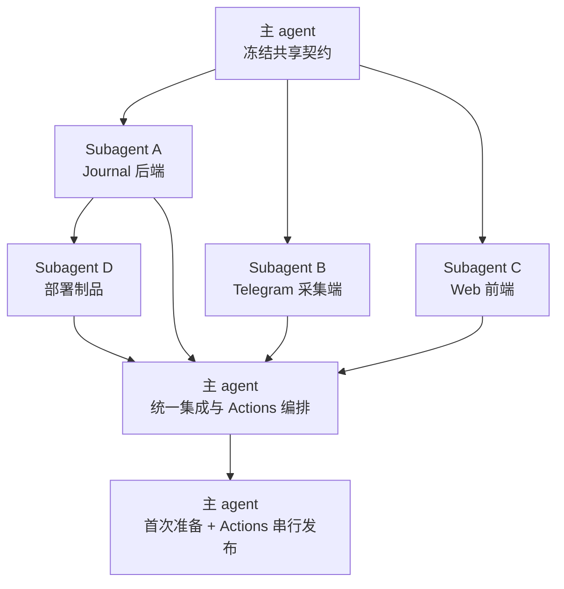

# Telegram Journal Subagent 执行任务拆分

状态：待确认  
日期：2026-07-19  
依据：`doc/design/journal/telegram-journal-personal-feed.md`  
范围：实现任务、文件所有权、并行顺序与集成边界；本文不代表已经开始编码或部署

## 1. 拆分结论

采用“主 agent 先冻结契约，三个 subagent 并行实现，主 agent 统一集成，部署单独执行”的方式。

第一轮并行任务为：

```text
主 agent：共享契约、公共配置与最终集成
├── Subagent A：rndc02 Journal 后端、数据与媒体
├── Subagent B：bwgdc01 Telegram 采集端
└── Subagent C：公开信息流与私有资产前端

第二轮
├── 主 agent：集成业务代码与收口跨模块问题
└── Subagent D：独立 Journal 部署制品与备份制品

第三轮
└── 主 agent：完成共享文件与统一 GitHub Actions 编排

第四轮
└── 主 agent：按安全顺序实施服务器部署
```

不按“每个人随意领取若干文件”的方式拆分。每个 subagent 必须拥有完整、互斥的目录边界；共享文件只由主 agent 修改，避免并行覆盖和不同理解同时进入成熟 bot 主路径。

## 2. 拆分原则

- 现有 bot 的提醒、订阅、定时任务和 Telegram long polling 属于稳定主路径，只由主 agent 完成最终接入。
- `bwgdc01` 与 `rndc02` 之间先确定协议，再分别实现两端；subagent 不自行扩展协议字段。
- Journal 后端是 Journal 记录与媒体的唯一数据源；Telegram 端不得增加本地 Journal 副本或失败暂存。
- 不引入重试、队列、fallback、缓存数据库、对象存储或额外状态机。
- 不允许两个 subagent 同时修改同一个文件；跨边界需求提交给主 agent 处理。
- 服务器状态变更不并行执行。真实部署、DNS、OpenResty、rclone 和 bot 进程变更由主 agent 按顺序控制。
- GitHub Actions 是正式代码发布入口；subagent 不绕过 workflow 直接覆盖线上应用代码。
- 每个任务以业务闭环为单位，避免把单个小文件拆成多个 agent，造成沟通成本高于实现成本。

### 2.1 现有自动发布事实

- `.github/workflows/deploy.yml` 在向 `main` 推送非文档变更时自动发布，也支持手动触发；
- workflow 通过 `SERVER_*` Secrets 定位当前 bot 服务器和目录；
- 它保留服务器 `.env`、`.npmrc` 与 `data/`，同步其余仓库文件，安装依赖并重启 `notinews-bot.service`；
- 用户已确认该链路部署当前 `bwgdc01` bot；
- 当前触发范围过宽，Journal 后端或前端变更也会造成 bot 重启，必须在实现进入 `main` 前收窄；
- `.github/workflows/daily-push.yml` 是一次性任务，不纳入 Journal 常驻服务发布。

### 2.2 对执行拆分的影响

- 现有 bot 部署 job 与 `SERVER_*` Secrets 保留，不为了 Journal 重写其业务步骤；
- 主 agent 负责把 `deploy.yml` 调整为按路径判断的统一编排，这是成熟 bot 主路径的一部分，不交给 subagent 独立修改；
- Journal-only 变更只运行 `rndc02` Journal job，bot-only 变更只运行现有 bot job；
- 共享协议、依赖或 workflow 变化需要两端发布时，Journal job 必须先完成，bot job 才能开始；
- 不能创建两个互不依赖、同时监听 `main` push 的生产 workflow，否则无法保证 Journal 与 bot 的发布顺序；
- Journal 的首次服务器准备由主 agent 完成，之后应用版本通过 GitHub Actions 自动发布。

## 3. 主 agent 前置任务 P0：冻结共享契约

### 3.1 目标

在 subagent 开始写入前，先确定两端和前端共同依赖的最小契约，使三条实现线无需猜测对方行为。

### 3.2 主 agent 独占文件

```text
src/shared/journalProtocol.ts
src/config/index.ts
package.json
pnpm-lock.yaml
tsconfig.json
src/resident.ts
src/bot/interactive.ts
src/reminders/migrations.ts
.github/workflows/deploy.yml
Dockerfile
docker-compose.yml
doc/design/journal/telegram-journal-*.md
```

上述文件在整个并行阶段默认禁止 subagent 修改。确需变更时，subagent 只说明需求，由主 agent 统一落盘。

### 3.3 需要先冻结的内容

- `POST /api/internal/telegram-entries` 的请求与响应 schema；
- `PATCH /api/internal/telegram-entries/:publicId/visibility` 的请求与响应 schema；
- 确定性请求标识 `chat_id:source_message_id`；
- `private`、`public` 可见性枚举；
- Telegram 原始 Message JSON、来源消息、相册和附件描述的字段边界；
- public feed、entry detail、private feed、on-this-day 的响应 DTO；
- 错误响应格式与 Telegram 端需要展示的错误信息；
- 两端环境变量名称；
- Journal 数据目录和媒体相对路径约定。

### 3.4 交付结果

共享协议成为实现依据。subagent 可以使用它，但不能各自复制一份稍有差异的类型定义。

## 4. Subagent A：Journal 后端、数据与媒体

### 4.1 文件所有权

```text
src/journal-server/**
```

### 4.2 输入

- 已确认的产品与技术设计；
- 主 agent 提供的 `src/shared/journalProtocol.ts`；
- `/opt/journal/data` 数据边界；
- Telegram 云端 Bot API 单文件 20 MB 限制。

### 4.3 子任务 A1：数据与附件主路径

- 建立 Journal 独立 SQLite 连接和迁移；
- 实现 `journal_entries`、`journal_assets` 与必要索引；
- 实现 `(chat_id, source_message_id)` 幂等写入；
- 实现记录、相册、标签、可见性和置顶查询；
- 实现临时目录、附件完整落盘、原子目录切换与 SQLite transaction；
- 使用成熟库处理 MIME、文件响应和通用协议，不手写低配替代品。

### 4.4 子任务 A2：Telegram 内容归档

- 从原始 Message JSON 提取正文、caption、entities、结构化内容与所有支持的 `file_id`；
- 使用环境变量中的 bot token 仅调用 `getFile` 下载媒体；
- 保存原始 JSON 和 Telegram 元数据，不保存 token；
- 超过 20 MB 或任一必要附件失败时直接暴露失败，不创建不完整成功记录；
- `rndc02` 代码不得调用 `bot.launch()`、`getUpdates` 或注册 webhook。

### 4.5 子任务 A3：Fastify API 与权限

- 实现内部写入和可见性接口；
- 实现 Bearer token、允许的 `TG_CHAT_ID` 和 Zod 输入校验；
- 实现公开 feed、公开详情、RSS、JSON Feed 和受控媒体路由；
- 实现单密码登录、签名 cookie、私有列表、搜索筛选、正文编辑、置顶、可见性和往年今日；
- 私有记录及媒体必须由后端查询条件和会话保护，不能依赖前端隐藏；
- 日志不得记录 Authorization、bot token 或完整私密正文。

### 4.6 不负责

- 不修改现有 bot handler、`resident.ts` 或提醒数据库迁移；
- 不实现 Vue 页面；
- 不编写服务器部署操作；
- 不为网络失败增加重试、队列或本地暂存。

### 4.7 交付判定

该目录能够作为完全独立的 Journal 服务入口，并且从代码边界上不存在 Telegram updates 消费路径。

## 5. Subagent B：Telegram 采集端

### 5.1 文件所有权

```text
src/journal-bot/**
```

### 5.2 输入

- 主 agent 冻结的内部 API schema；
- 当前 bot 的单用户鉴权方式；
- 现有普通文本提醒 handler 的优先级约束。

### 5.3 子任务 B1：内部 API client

- 发送原始 Message JSON、目标可见性和确定性请求标识；
- 使用 `JOURNAL_API_BASE_URL` 与 `JOURNAL_INGEST_TOKEN`；
- 把服务端错误明确转成用户可理解的 Journal 操作失败；
- 不发送 bot token，不上传媒体二进制；
- 不实现自动重试、备用地址或本地 Journal 存储。

### 5.4 子任务 B2：捕获会话

- 封装 `journal_capture_sessions` 的读取、建立与删除；
- 支持单独发送 `/note`、`/post` 后等待下一条消息；
- 保存成功或 `/cancel` 后删除会话；API 失败时保留会话；
- 不增加过期时间、后台清理和复杂状态机。

Subagent B 只提供 repository 模块及其所需 SQL 定义，不直接修改 `src/reminders/migrations.ts`。主 agent 在集成阶段把最终表结构加入现有迁移。

### 5.5 子任务 B3：Telegram handler

- 支持命令正文、回复消息、一次性等待和媒体 caption；
- 私有默认规则、`/note` 与 `/post` 目标可见性保持明确；
- Journal 消息被匹配后不再进入自然语言提醒解析；
- 保存结果通过编辑既有提示消息呈现，避免污染消息流；
- 结果卡片支持公开/私有切换和打开网站；
- Journal 失败只结束本次 handler，不改变 bot 其他功能。

### 5.6 不负责

- 不直接修改 `src/bot/interactive.ts`、`src/resident.ts` 或 `src/reminders/migrations.ts`；
- 不修改已有 reminder、scheduled jobs 或 callback 主逻辑；
- 不下载和保存媒体；
- 不实现 Journal Web API 或页面。

### 5.7 交付判定

该目录提供一个可由现有 bot 注册的单一入口，并保持 Journal 逻辑与成熟的 `interactive.ts` 主体分离。

## 6. Subagent C：Web 前端

### 6.1 文件所有权

```text
web/**
vite.config.ts
```

如果实施时决定把 Vite 配置放进 `web/`，则不创建仓库根部 `vite.config.ts`，仍保持该 subagent 的目录独占。

### 6.2 输入

- 主 agent 冻结的公开与私有 API DTO；
- 名称“小明同学”、既定简介与“明”字本地头像；
- 680px 单列信息流、移动优先、系统深浅色的视觉方向。

### 6.3 子任务 C1：公共展示能力

- 公开首页信息流；
- 记录详情与永久链接；
- 标签筛选和游标加载；
- 文字、图片、视频、圆形视频、语音、音频、文件、贴纸及结构化卡片；
- 本地 SVG 与 PNG 默认头像；
- 公开页面不请求或泄露私有数量、标签、媒体路径和时间分布。

### 6.4 子任务 C2：私有资产能力

- `/me` 登录与本人资产视图；
- 全部、私有、公开筛选；
- 关键词、标签、格式和日期筛选；
- 正文编辑、可见性切换、置顶与往年今日；
- 登录失效和 API 错误直接呈现，不伪造空列表或成功状态。

### 6.5 实现约束

- Vue 3 Composition API、`<script setup lang="ts">` 和单文件组件；
- 不引入 Pinia、Vue Router、组件库或原子 CSS 框架；
- Telegram 正文使用文本插值，不交给 `v-html`；
- 可见性不能只靠颜色表达；
- 不自行改变 API 字段或在前端补造服务端没有返回的数据。

### 6.6 不负责

- 不修改 Fastify route、数据库或 Telegram handler；
- 不修改根 `package.json` 和 lockfile，只向主 agent提交依赖需求；
- 不处理 OpenResty、Cloudflare 或容器部署。

### 6.7 交付判定

前端只依赖已冻结 API 契约，公开与私有视图复用记录展示组件，但权限不由组件承担。

## 7. 主 agent 集成任务 P1

第一轮 subagent 交付后，主 agent 开始集成；收到 Subagent D 的部署制品后再完成生产 workflow：

1. 审核三个目录是否遵守共享 schema 和文件所有权；
2. 汇总依赖并统一修改 `package.json` 与 lockfile；
3. 把 `journal_capture_sessions` 加入现有提醒数据库迁移；
4. 在 `interactive.ts` 的正确位置注册 Journal handler，保证它先于普通文本提醒解析；
5. 在 `resident.ts` 保持唯一 `bot.launch()`，只接入 Journal handler，不启动 Journal Web；
6. 为 Journal server 增加独立入口和脚本配置；
7. 把现有 `deploy.yml` 调整为路径感知的统一生产发布编排，同时保留当前 bot job 与 `SERVER_*` Secrets；
8. 增加 Journal job 的独立 Secrets、非 root SSH 身份、固定 known_hosts、不可变镜像和 `/opt/journal` 数据保留边界；
9. 设置 job 依赖：Journal-only 不重启 bot，bot-only 不操作 Journal，共享变更先 Journal 后 bot；
10. 处理跨模块类型、路径和错误契约差异；
11. 确认没有改动 `src/reminders/recurring.ts` 的 `rrule` 导入方式；
12. 确认现有 bot 与 Journal 服务没有共同启动依赖。

集成阶段不把 subagent 的所有实现机械拼接。若交付与已冻结契约冲突，以主 agent 的共享契约和已确认设计为准，并把冲突退回原负责方做局部修正。

## 8. Subagent D：Journal 部署制品

该任务在 Subagent A 的 Journal 服务入口和目录结构稳定后开始，可与主 agent 的业务代码集成并行；它不修改主 agent 独占的共享文件。

### 8.1 文件所有权

```text
deploy/journal/**
scripts/journal-backup
```

### 8.2 任务内容

- 为 Journal 创建独立 Docker 镜像定义和 Compose 模板；
- 只映射 `127.0.0.1:3100`，数据挂载到 `/opt/journal/data`；
- 设置 `Asia/Shanghai`、1 CPU 和 512 MiB 资源边界；
- 不连接现有 MySQL、Redis、xboard 或 1Panel 业务网络；
- 提供独立 OpenResty 站点配置模板，不修改已有站点模板；
- 提供 Journal 独立 rclone 备份制品，远端目录为 `NotiNewsBackups-LongTerm/rndc02-journal`；
- 备份范围只包含 Journal 自身目录和独立站点配置，不接管 `bwgdc01` 现有备份。
- 明确 GitHub Actions 构建所需的 Journal 镜像入口、镜像标签、Compose 版本变量和持久化挂载；实际 workflow 由主 agent 集成。

### 8.3 不负责

- 不直接 SSH 修改 `rndc02`；
- 不安装 rclone；
- 不创建 Cloudflare DNS 或证书；
- 不停止、重启或重建任何线上容器与 bot；
- 不修改 `.github/workflows/deploy.yml` 或另建一个独立监听 `main` 的生产发布 workflow；
- 不修改现有根 `Dockerfile`、`docker-compose.yml`、`scripts/notinews-backup` 和 systemd 文件。

真实服务器变更由主 agent 在代码与部署制品确认后串行执行。

## 9. 并行时序与依赖关系



具体波次：

| 波次 | 并行槽位 | 任务 | 开始条件 |
| --- | --- | --- | --- |
| 0 | 主 agent | P0 共享契约 | 方案确认后 |
| 1 | A / B / C | 后端、Telegram、前端并行 | P0 完成 |
| 2 | 主 agent + D | 主 agent 集成业务代码；D 准备独立部署制品 | A / B / C 完成；D 只需 A 的服务入口稳定 |
| 3 | 主 agent | 完成共享文件和统一 Actions 编排 | A / B / C / D 完成 |
| 4 | 主 agent | 首次准备 `rndc02`，再由统一 Actions 编排先发布 Journal、后发布 bot | 代码与部署方案均确认后 |

Subagent C 不等待后端代码，只依赖 P0 的 DTO；Subagent B 不等待 Journal 实现，只依赖内部接口 schema。Subagent D 必须等待 Subagent A 的 Journal 服务入口和产物目录稳定，不能提前猜测容器启动方式；主 agent 必须收到 D 的制品后才能完成生产 workflow。

## 10. 跨 agent 协作规则

### 10.1 变更申请

当 subagent 发现共享契约或共享文件必须调整时，应向主 agent提交：

- 需要调整的字段或文件；
- 当前设计无法完成的具体原因；
- 对另外两个任务的影响；
- 最小变更建议。

未得到主 agent确认前，不跨目录直接修改。

### 10.2 交付说明

每个 subagent 结束时只需提交：

- 已完成的业务能力；
- 实际修改的文件；
- 依赖主 agent处理的共享文件变更；
- 与已冻结契约存在的差异；
- 尚未解决且会阻塞集成的问题。

不要把未来功能建议混入当前交付，也不要因为理论上的异常场景扩大实现。

### 10.3 冲突处理

- 协议冲突：以 P0 共享 schema 为准；
- 数据所有权冲突：以 `rndc02` Journal 为唯一数据源；
- handler 顺序冲突：由主 agent在 `interactive.ts` 集成时决定；
- UI 缺字段：先判断是否属于已确认产品需求，再由主 agent调整契约；
- 部署路径冲突：保持 `/opt/journal` 与现有服务完全隔离。

## 11. 真实部署的职责边界

首次服务器准备不交给多个 subagent 并行操作，主 agent 负责完整顺序：

1. 重新读取 `rndc02` 当时的容器、端口、OpenResty 和 DNS 实际状态；
2. 建立 Journal 专用非 root 部署用户、固定 SSH host key、`/opt/journal` 权限和 GitHub Actions Secrets；
3. 建立独立域名、HTTPS、数据目录与 rclone 备份，不触碰 `bwgdc01` bot；
4. 将包含路径判断、Journal job 和原 bot job 的统一 workflow 与实现一起进入 `main`；在此之前不把 Journal 实现单独推入现有宽泛 workflow；
5. 由 GitHub Actions 先发布 `rndc02` Journal，Journal job 成功后才执行 `bwgdc01` bot job；
6. 后续代码发布继续走同一 Actions 编排，Journal-only 与 bot-only 变更互不重启对方；
7. 始终保持 `bwgdc01` 为唯一 Telegram long polling 实例。

GitHub Actions 负责后续应用版本发布，主 agent 负责首次基础设施准备、workflow 变更范围和发布顺序。不得把自动发布理解成允许 workflow 修改 1Panel 其他站点、Cloudflare 其他记录、Docker daemon 或已有容器。

该顺序是当前安全方案的一部分。任何 subagent 的实现便利都不能把它改回“整体迁移并切换 bot”的方案。

## 12. 建议采用的最终任务清单

| ID | 执行者 | 任务 | 主要产物 | 依赖 |
| --- | --- | --- | --- | --- |
| P0 | 主 agent | 冻结共享协议、DTO、配置名和目录 | `src/shared/journalProtocol.ts` 等共享定义 | 无 |
| A | Subagent A | Journal DB、附件、Telegram 文件下载、Fastify API | `src/journal-server/**` | P0 |
| B | Subagent B | `/note`、`/post`、等待状态和内部 API client | `src/journal-bot/**` | P0 |
| C | Subagent C | 公开信息流与私有资产前端 | `web/**` | P0 |
| D | Subagent D | Journal 独立容器、OpenResty 与备份制品 | `deploy/journal/**`、`scripts/journal-backup` | A |
| P1 | 主 agent | 依赖、迁移、handler 顺序、入口、跨模块集成与路径感知的统一 Actions 编排 | 共享文件的最小修改、`.github/workflows/deploy.yml` | A / B / C / D |
| P2 | 主 agent | `rndc02` 首次准备，并通过 Actions 先发布 Journal、后发布 bot | 两节点正式运行、后续 push 自动按路径发布 | P1 |

该拆分在当前四个并发槽位下最多同时使用三个 subagent，加上主 agent 正好四个执行者；同时把所有高冲突和线上高风险操作集中到主 agent，符合本项目“主路径清晰、安全优先、不得影响已有服务”的要求。
